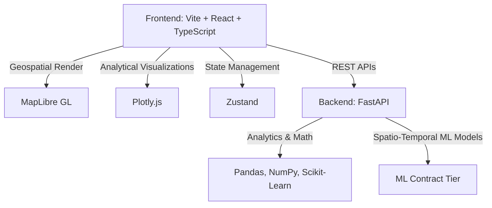

# 🚦 Chennai Traffic Intelligence & Multidimensional Visualization Platform

A high-performance, interactive **Traffic Authority Command & Intelligence System** designed for Metropolitan Traffic Authorities, Transportation Analysts, and Urban Mobility Planners in Chennai.

Rather than a static analytics dashboard, this platform is an operational geospatial command center anchored around an interactive geographic map of Chennai's arterial road network. It allows operators to explore traffic congestion, accident patterns, day-to-day trends, directional flow vectors, unsupervised K-Means behavioral clustering, and machine-learning-driven 30-minute predictive forecasting.

---

## 🏛️ Project Architecture & Tech Stack



### Frontend Technology Stack

- **Core Framework:** React 18 with TypeScript and Vite.
- **Geospatial Engine:** MapLibre GL for rendering Chennai's arterial road network as vector polylines.
- **Analytical Charting:** Plotly.js (Plotly.js-dist-min) for dual-axis time-series, day-by-hour matrices, regression scatter plots, correlation matrices, and radar charts.
- **State Management:** Zustand for lightweight, reactive coordinated filtering and time simulation states.
- **Icons & Styling:** Lucide-React and highly custom Vanilla CSS dark themes.

### Backend Technology Stack

- **API Engine:** FastAPI (Python 3.10+) serving endpoints for geospatial roads, historical analytics, automated insight generation, and ML models.
- **Numerical & ML Compute:** Pandas, NumPy, Scikit-Learn (K-Means Clustering, Greenshields model fitting).

---

## 🌟 Key Features

1. **Geospatial Traffic Layer:** Road-level vector linestrings colored by traffic density using standard traffic severity indices (Green for Free-flow $\rightarrow$ Crimson for Severe Bottlenecks).
2. **Accident & Safety Layer:** Spot markers mapping accident hot spots, incident severity, and historical correlation with weather conditions.
3. **Temporal Control Slider:** Play/Pause controls with configurable playback speeds ($1x, 2x, 5x$) allowing temporal visualization of traffic flow over a 24-hour diurnal cycle.
4. **Coordinated Multi-Filters:** Synchronous state updates across all cards, drawers, leaderboards, maps, and plots upon changing spatial zones, rain metrics, or severity tiers.
5. **Location Intelligence Drawer:** Slides out contextual deep-dives for any selected corridor, displaying speed deficit metrics, road utilization, and dispatch recommendations.
6. **Pearson Correlation Matrix:** Explores the statistical interactions of lane capacity, volume, speed, visibility, and precipitation.
7. **Directional Flow Vectors:** Visualizes live arterial flow direction using animated particle trajectories on the map.
8. **Unsupervised Behavioral Clustering:** Groups corridors dynamically using K-Means clustering based on congestion profiles (e.g., Rain-Sensitive Arterials, Peak-Hour Chokepoints) mapped visually on the canvas.
9. **✦ ML Predictive Forecasting (+30m):** Renders a purple predictive spatial forecast layer alongside confidence intervals ($95\%$ bounds) and feature importance bars.

---

## 📊 Data Lineage & Tiering

The platform explicitly demarcates all telemetry labels for decision-making integrity:

| Data Tier               | Description                                                           | Display Locations                            |
| :---------------------- | :-------------------------------------------------------------------- | :------------------------------------------- |
| **`OBSERVED`**  | Actual physical coordinates and properties of Chennai roadways.       | Map geometry, road names, speed limit.       |
| **`DERIVED`**   | Mathematically calculated indices (Congestion Index, Priority Score). | Leaderboards, KPI cards, correlation values. |
| **`PREDICTED`** | ML-inferred congestion estimates with confidence bounds.              | Predictive map layer, ML forecast charts.    |
| **`SIMULATED`** | Synthetic fixtures mapped to standard diurnal shapes.                 | Identified with a`"SIMULATED DATA"` badge. |

---

## 📂 Project Structure

```
ADV-trafficcongestion-project/
├── backend/                  # FastAPI Application
│   ├── api/                  # Route handlers (traffic, analytics, ml, insights)
│   ├── services/             # Core compute and data serving logic
│   ├── models/               # Pydantic schemas and ML loaders
│   ├── main.py               # Main uvicorn server configuration
│   └── requirements.txt      # Python dependencies
├── frontend/                 # Vite + React Client
│   ├── src/                  # Components, styles, state, hooks
│   ├── package.json          # Node dependencies
│   ├── vite.config.ts        # Vite configuration
│   └── index.html            # Main markup entry point
├── docs/                     # Technical documentation & walkthroughs
│   ├── prd-summary.md        # Requirement quick references
│   └── walkthrough.md        # Step-by-step evaluation guide
└── data/                     # Geospatial and analytical data fixtures
```

---

## ⚡ Quick Start & Run Instructions

### Prerequisites

- Python 3.10 or higher installed.
- Node.js (v18+) and npm installed.

### 1. Running the Standalone Frontend

You can run the web client locally using Vite:

```bash
cd frontend
npm install
npm run dev
```

Open the local URL (usually `http://localhost:5173`) in Google Chrome or Firefox.

### 2. Running the Backend API Server

Install dependencies and run the FastAPI server:

```bash
cd backend
pip install -r requirements.txt
python -m backend.main
```

The server will run on `http://127.0.0.1:8000`. You can access the interactive Swagger documentation at `http://127.0.0.1:8000/docs`.

---

## 🧭 Evaluation Walkthrough

To review the system flow end-to-end, refer to [docs/walkthrough.md](file:///e:/ADV-trafficcongestion-project/docs/walkthrough.md), which contains a 10-step guide detailing the baseline views, analytical charts, K-Means clustering toggles, and ML prediction interfaces.
